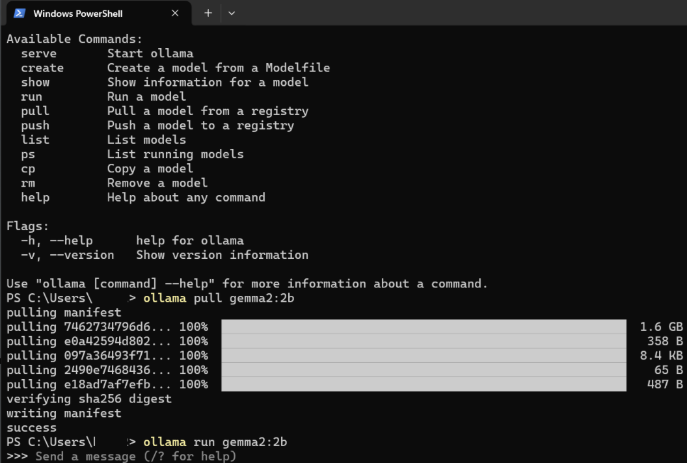
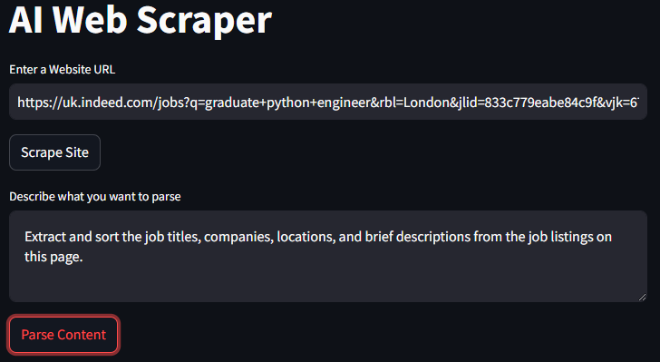
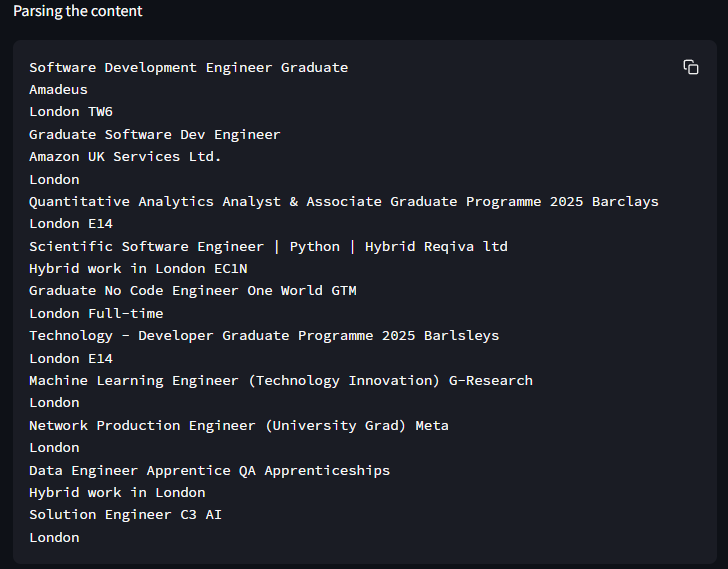
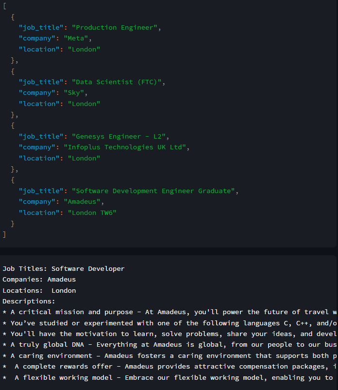

# AI Web Scraper

This project is an AI-powered web scraper designed to extract structured data from websites such as job boards, ecommerce platforms, and other listings. It uses the **Gemma 2:2b** model from **Ollama**, which was pulled and integrated for natural language processing tasks. The web scraper connects to **Bright Data** for proxy services to scrape data effectively. However, unlike my other web applications, this one is not deployed for open use, and users need to handle their own API tokens for both Bright Data and Ollama services.

## Key Features
- Scrapes website content based on URL input.
- Leverages the **Gemma 2:2b** model for parsing and understanding the data.
- Extracts data such as job titles, companies, locations, and descriptions from job listing websites like **Indeed**.
- Output data in both text and JSON formats for easy interpretation.

## Screenshots and Functionality

### 1. **Ollama Model Pull**


In this screenshot, I use the `ollama pull` command to retrieve the Gemma 2:2b model, which is then utilised to run the AI web scraping tasks.

### 2. **Scraping Job Listings**


The web UI, built with **Streamlit**, allows users to input a URL (in this case, job listings from Indeed), along with a prompt explaining what content to extract. For example, in this case, we aim to extract job titles, companies, and locations.
 
### 3. **Parsed Content**


This image demonstrates the scraper successfully parsing job listings and outputting them in a structured format. It shows the ability of the system to extract relevant details from job listings effectively.

### 4. **Formatted Output**


The extracted data is also presented in JSON format, allowing for easy integration into other applications or storage systems.

## Technologies Used
The project makes use of several important libraries:
- **Streamlit** for building the web interface.
- **Langchain** and **Langchain Ollama** for integrating AI models.
- **Selenium**, **BeautifulSoup4**, and **lxml** for web scraping functionalities.
- **Bright Data** for proxy handling.

For all dependencies, you can refer to the `requirements.txt` file:

```plaintext
streamlit
langchain
langchain_ollama
selenium
beautifulsoup4
lxml
html5lib
python-dotenv
```

## How It Works

### Step 1: Connecting to Ollama (Gemma 2:2b)
The AI web scraper is powered by the **Gemma 2:2b** model, which was pulled from **Ollama**. This model is designed for natural language processing tasks and offers good performance in understanding and parsing text from web content.

#### Pros of the Gemma 2:2b Model:
- **Effective NLP**: The model can handle various types of text input and excels at parsing job descriptions or summarising content.
- **Open-Source and Extensible**: Ollama provides easy integration, allowing for further customisation and scalability.

#### Cons:
- **Heavy Memory Usage**: The model consumes significant resources, which could slow down scraping if not run on a powerful machine.
- **Latency**: For large web pages or data-intensive tasks, response times may lag.

### Step 2: Using Bright Data for Scraping
The application connects to **Bright Data** for proxy services, which is essential for scraping larger websites like job boards. This ensures that the scraper can bypass rate limits and avoid IP bans.

However, users need to **provide their own Bright Data tokens** as this project is not set up for open use.

## Use Cases

Here are some potential use cases for this web scraper:

- **Job Aggregation**: Collect job listings from multiple sites and organise them into structured datasets.
- **Ecommerce Data Collection**: Extract product details, prices, and reviews from online stores for competitive analysis.
- **Market Research**: Gather and analyse data from multiple sources to identify trends or monitor competitors.

## Conclusion

This AI Web Scraper offers a powerful way to automate data collection from websites using state-of-the-art NLP models and proxy services. While this particular tool is not deployed for open use, it demonstrates the capabilities of combining web scraping with AI-powered parsing to achieve efficient and accurate data extraction.